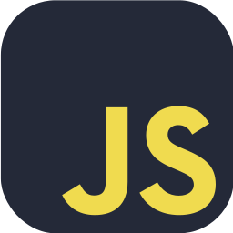
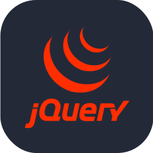
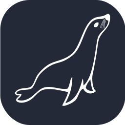
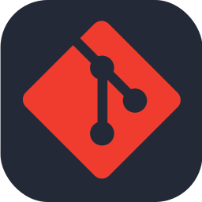
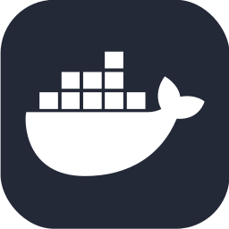
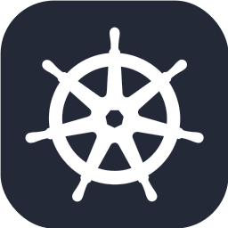
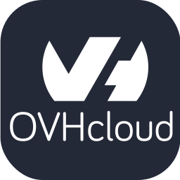
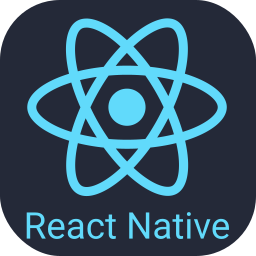

# Hi there 👋, I'm Jean-Guillaume ! 

I am very flexible and easily adapt to different roles (Full Stack Web Developer 🌐, App Developer 📱, Software Architect ✏️) depending on the needs of the project. I love exploring new tech stacks 💻 and using them to create cool stuff 🛠️.

## 🧐 More About Me: 

- 🔭 I’m currently working on a web app for freelances
- 🌱 I’m currently learning [Symfony](https://symfony.com/) and [VueJS](https://vuejs.org/)
- 📫 You can contact me on [Linkedin](https://www.linkedin.com/in/jeanguillaumezaplana/)
- 🏍️ We may meet on the roads, bikers ! ✌️
- 💻 I like programmer and I'm really excited to learn new technologies
- 🤝 I'm always looking to collaborate on new projects or ideas

## 🔨 Languages and Tools:

## 🔍 Next learning:

